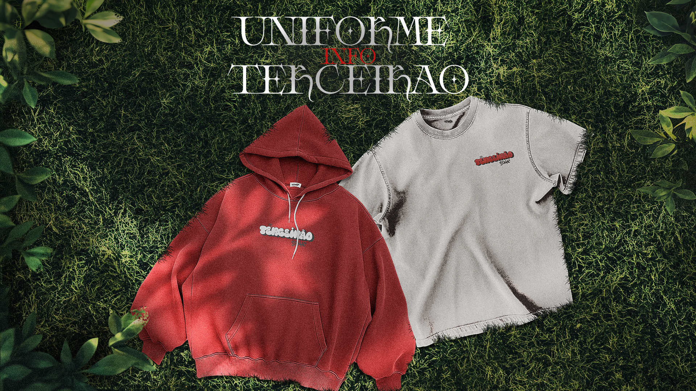

# Design da Camisa do Terceirão

Design desenvolvido utilizando o **Adobe Photoshop**, com apoio de elementos visuais de referência coletados na internet. O projeto foi realizado ao longo de **1 mês**, em conjunto com opiniões gerais da turma. As cores foram definidas de acordo com a identidade da turma, e o material final foi enviado à gráfica responsável pela **impressão** e **confecção dos uniformes.**

---

Projeto realizado para o **terceiro ano do Ensino Médio**, integrado ao **Técnico em Informática**, por:

- Lucas (Nevasca) Merini Flores
